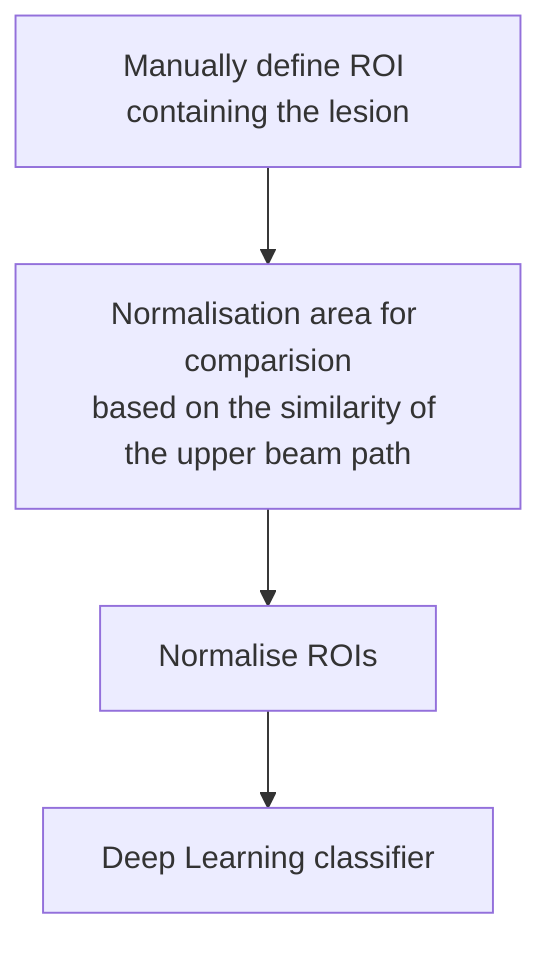

Physician guided analysis of focal liver lesions from raw ultrasound signals 
===


# Introduction
As part of the [Medtech Hackathon](https://github.com/Medtech-hackathon), we present an innovative approach to **focal liver lesion analysis** based on raw radiofrequency (RF) data. We propose a comprehensive workflow that includes guided data extraction integrated into an intuitive graphical user interface (GUI). This interface is designed to assist physicians to select a region of interest (ROI) containing the lesion and a corresponding reference area (RA) from the processed B-mode image, and then extract the corresponding raw RF data. The RA is chosen based on the similarity to the tissue above the ROI, as it should have the same depth and thus compensate for the effect that the previous tissue has on the signal. The similarity is estimated based on the previous tissue of the ROI which is used as a kernel to apply operations like convolutions or cross-correlations on the remaining previous tissue regions.

A key feature is the guided extraction of the RA based on the ROI, as this allows for later normalisation of the extracted lesion, i.e. extraction of standardised ROIs of the RF signal.
The ROIs contain only the lesion with a reduced effect of the tissue proximal in the beam of the emitted sound pressure waves. Standardised extraction will be essential to minimise variability in the absolute RF signal due to differences in depth and tissue context.


The primary objective of our project is to design a structured framework for RF signal data post-processing, which can then be used to train deep learning models for lesion classification. By focusing on raw RF data, this model has the potential to be implemented in cost-effective handheld ultrasound devices, thereby expanding access to advanced diagnostic capabilities.


# Medical background
---
Focal liver lesions are often found incidentally on routine sonography. The entity can range from benign cysts or haemangiomas to highly malignant carcinomas or metastases. The specific entity is sometimes difficult to distinguish on B-mode imaging alone, requiring the use of costly contrast-enhanced ultrasound (CEUS) or biopsy for accurate diagnosis and appropriate treatment decision.
# Approach
Provide streamlined software to:
1. Extract RF signal snippets from the raw ultrasound data corresponding to the selected ROI in the B-mode image.
2. Support the user to extract an optimal RA that can be used for normalisation.
3. Provide a normalised dataset and the modelling pipeline to train a supervised deep learning model for lesion prediction.
# Workflow



# Repository Overview
This repository contains the following important files
1. An interactive notebook explaining the proposed approach **``Previous_Tissue_Analysis.ipynb``** 
2. a graphical user interface (GUI) for raw ultrasound analysis (see: How to use the GUI) **``app4.0.py``** 
3. An interactive notebook showing how to extract a data frame from annotated ROIs, with the option to apply normalisation to the ROIs. 
**``ROI_normalization_pipeline.ipynb``** 


# How to use the GUI

0. Setup:
    i. Make sure Python 3 or higher is installed. It is advisable to  [setup a virtual environment] (https://python.land/virtual-environments/virtualenv).
    ii. Clone (or download) the repository.
    iii. Open the terminal from within the repository folder.
    iv. Run `pip install -r requirements.txt`

2. Load Data: Select the folder with the raw data files. The GUI requires the following folder structure: 

    ```
    main_folder
        ├───PatientUI0
        │   └───rawdata
        │        ├───raw_0_0.tar_extracted
        │        │              :
        │        │              ├───L15_large_env.raw.npy
        │        │              └───L15_large_rf.raw.npy
        │        │              
        │        ├───raw_0_1.tar_extracted
        │        │              :
        │        │              ├───L15_large_env.raw.npy
        │        │              └───L15_large_rf.raw.npy
        │        │
        │        ├───raw_n_i.tar_extracted
        │        │         :
        │        │ 
        │        ├───0_0.dcm
        │        ├───0_1.dcm
        │        :
        │        └───n_i.dcm
        :
        └───PatientUIm
            └───rawdata
                 :
    
        
2. The drop down allows you to choose the n-th scan for each patient.
3. The user selects a patient file from the displayed file list.
4. A DICOM image is displayed.
5. A B-mode image is displayed. 
6. Slider: Allows  to scroll through the frames.
7. The user can select a region of interest (ROI) on the B mode image.
8. Generate Bar Plot: The application will generate a bar plot based on the previous tissue of the ROI. 
9. The user can select a bar on the bar plot. This selection corresponds to the reference area (green). 
10. Save session: The user can save the annotations and details  for the patient in a csv file (it is recommended to save all the patients' data in the same folder).
11. The user can reset the whole session and continue with the new selection.


# Get in touch
[Schneider C. Lab, Medical Clinic III, RWTH Uniklinik, Aachen](https://www.ukaachen.de/kliniken-institute/klinik-fuer-gastroenterologie-stoffwechselerkrankungen-und-internistische-intensivmedizin-med-klinik-iii/forschung/ag-schneider-carolin/)

