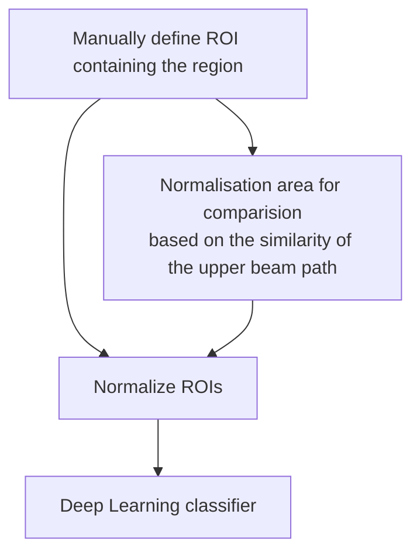

Physician guided analysis of focal liver lesions from raw ultrasound signals 
===

# Introduction
In the context of the [Medtech Hackathon](https://github.com/Medtech-hackathon), we present an innovative approach to **focal liver lesion analysis** based on raw radiofrequency (RF) data. We propose a comprehensive workflow that includes a guided data extraction, integrated into an intuitive graphical user interface (GUI). This interface is designed to assist medical experts in selecting a region of interest containing the lesion (ROI) and a corresponding reference area (RA) directly from the raw RF data. The RA is chosen based on the similarity to the tissue above the ROI, as it should have the same depth and thereby compensate for the .

A key feature of our system is the normalization by the RA, because this allows for the extraction of standardized ROIs of the RF signal. These only contain the lesion with reduced effect of the tissue proximal in the beam of emitted sound pressure waves. This standardized extraction is essential for minimizing variability in the absolute RF signal due to differences in depth and tissue context.

The primary objective of our project is to establish a structured framework for RF-signal data postprocessing, which can subsequently be utilized to train deep learning models for lesion classification. By focusing on raw RF data, this model has the potential to be implemented in cost-effective handheld ultrasound devices, thereby expanding access to advanced diagnostic capabilities.

# Table of Contents
[TOC]


# Medical background
---
Focal liver lesions are often found accidentally in routine sonography exams. The entity can range from benign cysts or hemanioma to highly malignant carcinomas or metastasis. The specific entity is sometimes difficult to distinguish based solely on the B-mode image, necessitating the use of costly contrast-enhanced ultrasonography (CEUS) or a biopsy for accurate diagnosis and adequat treatment decision.
# Approach
Provide a streamlined software to:
1. Extract RF signal snippets from raw Ultrasound data, corresponding to the ROI selected in the B-Mode image.
2. Support the user to extract an optimal reference area, that can be used for normalisation.
3. Provide a normalised dataset and the modelling pipeline to train a supervised deep learning model for lesion prediction.

# Workflow



# Repository Overview
This repository contains the following important files:
**``Previous_Tissue_Analysis.ipynb``**
an interactive notebook explaining the proposed approach. 
**``app4.0.py``**
a Graphic User Interface(GUI) for raw Ultrasound analysis (see: How to use the GUI)
**``ROI_normalization_pipeline.ipynb``**
An interactive notebook showing how to extract a dataframe from annotated ROIs with the option of applying a normalization on the ROIs


# How to use the GUI 

0. Setup:
    i. Make sure Python 3 or higher is installed. It is advisable to  [setup a virtual environment](https://python.land/virtual-environments/virtualenv).
    ii. Clone (or download) the repository.
    iii. Open the terminal from within the repository folder.
    iv. Run `pip install -r requirements.txt`

2. Load Data: select the folder with the raw data files. GUI assumes the following folder structure: 

    ```
    main_folder
        ├───PatientUI0
        │   └───rawdata
        │        ├───raw_0_0.tar_extracted
        │        │              :
        │        │              ├───L15_large_env.raw.npy
        │        │              └───L15_large_rf.raw.npy
        │        │              
        │        ├───raw_0_1.tar_extracted
        │        │              :
        │        │              ├───L15_large_env.raw.npy
        │        │              └───L15_large_rf.raw.npy
        │        │
        │        ├───raw_n_i.tar_extracted
        │        │         :
        │        │ 
        │        ├───0_0.dcm
        │        ├───0_1.dcm
        │        :
        │        └───n_i.dcm
        :
        └───PatientUIm
            └───rawdata
                 :
    
        
2. The slider allows to go through the n-th scan for each patient.
3. The user selects a patient file from the displayed list of files.
4. A dicom image is displayed.
5. A B mode image is shown. 
6. Slider: Allows to slide through the frames.
7. The user can select a region of interest (ROI) on the B mode image.
8. Generates Bar Plot: The application generates a bar plot based on the ROI coordinates.
9. The user can select a bar on the bar plot. This selection will correspond to the reference area (green). 
10. Save Session: User can save the annotated co-ordinates for the patient(It is recommended to store all patients into the same folder).
11. The user can reset the whole session and continue with the new selection.


# Appendix and FAQ

:::info
**Just do it!**
:::

### Get in touch
[Schneider C. Lab, Medical Clinic III, RWTH Uniklinik, Aachen](https://www.ukaachen.de/kliniken-institute/klinik-fuer-gastroenterologie-stoffwechselerkrankungen-und-internistische-intensivmedizin-med-klinik-iii/forschung/ag-schneider-carolin/)


